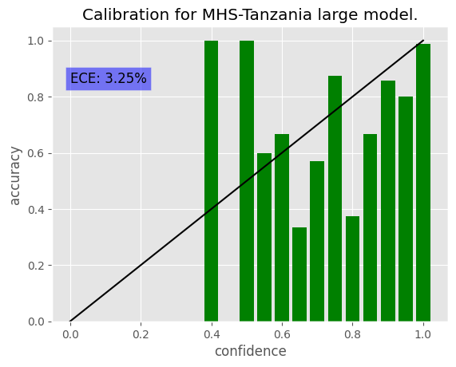
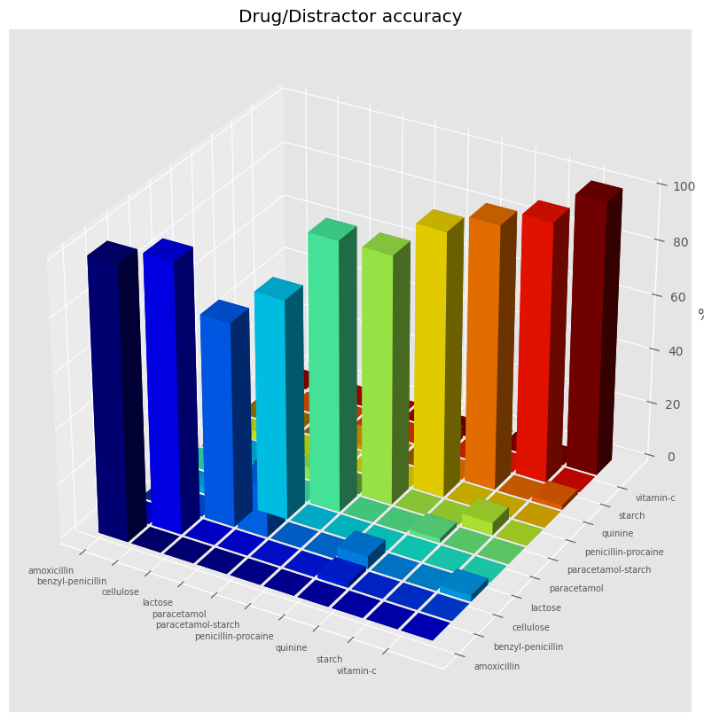
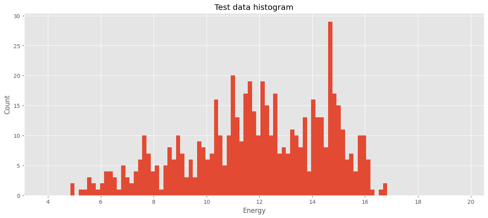

## Results for MHS-Tanzania
### Parameters
| Parameter | Value |
| --------- | ----- |
| Dataset | /mnt/slow_data/pmoreira/datasets/MHS-Tanzania |
|experiment | mshtv1|
|arch |MHS_Tanzania_large_1_23_convnet|
|data_folder | ../MHS-Tanzania/MHS-Tanzania/|
| weights | /home/csweet1/projects/pads/fhi360_lite_dvc_test/experiments/weights/MHS_Tanzania_large_1_23_convnet_mshtv1/ |
| NETWORK | ConvNet |
| num_epochs | 100 |
| IMG_SHAPE | (454, 454,3) |
|batch_size | 16|
| drugs | ['amoxicillin', 'benzyl-penicillin', 'cellulose', 'lactose', 'paracetamol', 'paracetamol-starch', 'penicillin-procaine', 'quinine', 'starch', 'vitamin-c']|
| Number of classes | 10 |

### Training summary
```
Epoch 100/100
118/118 [==============================] - 189s 2s/step - loss: 0.0911 - accuracy: 0.9693 - val_loss: 0.3422 - val_accuracy: 0.9322
Trained
INFO:tensorflow:Assets written to: experiments/weights/MHS_Tanzania_large_1_23_convnet_mshtv1/assets
INFO:tensorflow:Assets written to: experiments/weights/MHS_Tanzania_large_1_23_convnet_mshtv1/assets
```

### Test Data Results
```
Bin data 590.0002 [0.         0.         0.         0.         0.         0.
 0.         0.99999    0.         0.99999    0.5999994  0.66666444
 0.33333222 0.57142776 0.87499891 0.37499953 0.66666556 0.85714163
 0.79999968 0.9882583 ] [0.05 0.1  0.15 0.2  0.25 0.3  0.35 0.4  0.45 0.5  0.55 0.6  0.65 0.7
 0.75 0.8  0.85 0.9  0.95 1.   1.05] [1.0000000e-05 1.0000000e-05 1.0000000e-05 1.0000000e-05 1.0000000e-05
 1.0000000e-05 1.0000000e-05 1.0000100e+00 1.0000000e-05 1.0000100e+00
 1.0000010e+01 3.0000100e+00 3.0000100e+00 7.0000100e+00 8.0000100e+00
 8.0000100e+00 6.0000100e+00 7.0000100e+00 2.5000010e+01 5.1100001e+02]
ECE 0.03245766187875879
Result [ 59.  63.  32.  36.  64.  20.  60.  58.  41. 127.] [ 59.  64.  43.  45.  65.  22.  62.  60.  43. 127.] [1.         0.984375   0.74418605 0.8        0.98461538 0.90909091
 0.96774194 0.96666667 0.95348837 1.        ]
Matrix [[ 59.   0.   0.   0.   0.   0.   0.   0.   0.   0.]
 [  0.  63.   0.   0.   0.   0.   1.   0.   0.   0.]
 [  0.   0.  32.   8.   0.   0.   2.   0.   0.   1.]
 [  0.   1.   8.  36.   0.   0.   0.   0.   0.   0.]
 [  0.   0.   0.   0.  64.   0.   0.   1.   0.   0.]
 [  0.   0.   0.   1.   0.  20.   0.   0.   1.   0.]
 [  0.   2.   0.   0.   0.   0.  60.   0.   0.   0.]
 [  0.   0.   0.   1.   0.   0.   0.  58.   0.   1.]
 [  0.   0.   0.   0.   0.   2.   0.   0.  41.   0.]
 [  0.   0.   0.   0.   0.   0.   0.   0.   0. 127.]]
Total 0.9491525423728814 590
```

### Calibration


### Prediction Top 2
```
0. amoxicillin : amoxicillin 1.0 , vitamin-c 0.0
1. benzyl-penicillin : benzyl-penicillin 0.984 , penicillin-procaine 0.015
2. cellulose : cellulose 0.744 , lactose 0.186
3. lactose : lactose 0.8 , cellulose 0.177
4. paracetamol : paracetamol 0.984 , quinine 0.015
5. paracetamol-starch : paracetamol-starch 0.909 , starch 0.045
6. penicillin-procaine : penicillin-procaine 0.967 , benzyl-penicillin 0.032
7. quinine : quinine 0.966 , vitamin-c 0.016
8. starch : starch 0.953 , paracetamol-starch 0.046
9. vitamin-c : vitamin-c 1.0 , starch 0.0
```

### Accuracy Per Drug/Distractor


### Energy Distribution

